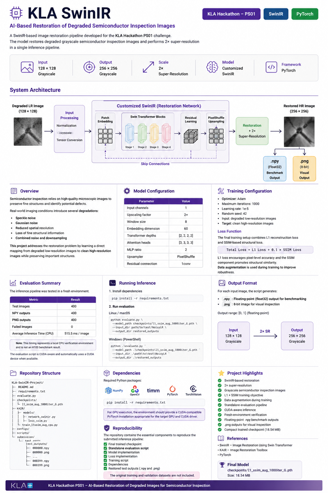

# KLA SwinIR

### AI-Based Restoration of Degraded Semiconductor Inspection Images

A SwinIR-based image restoration pipeline developed for the KLA Hackathon PS01 challenge.

The project focuses on restoring degraded grayscale semiconductor inspection images while performing 2× super-resolution in a single inference pipeline.



---

## 1. Project Overview

High-quality inspection images are important for preserving small structures and visual details during semiconductor analysis.

Real-world imaging conditions can introduce:

- Speckle noise
- Gaussian noise
- Reduced spatial resolution
- Loss of fine structural information
- Combined noise and downsampling degradation

This project learns a direct mapping from a degraded low-resolution image to its clean high-resolution counterpart.

| Property | Configuration |
|---|---|
| Input | 128 × 128 grayscale |
| Output | 256 × 256 grayscale |
| Upscaling | 2× |
| Model | Customized SwinIR |
| Framework | PyTorch |

---

## 2. System Architecture

The complete restoration pipeline follows this flow:

```text
                 KLA SwinIR Restoration Pipeline

     Degraded Low-Resolution Image
                128 × 128
                    │
                    ▼
          ┌──────────────────┐
          │ Input Processing │
          └────────┬─────────┘
                   │
                   ▼
       ┌──────────────────────────┐
       │     Customized SwinIR    │
       │                          │
       │  Swin Transformer Blocks │
       │  Shifted-Window Attention│
       │  Residual Learning       │
       │  PixelShuffle Upsampling │
       └────────────┬─────────────┘
                    │
                    ▼
          Restoration + 2× SR
                    │
                    ▼
          Restored High-Resolution
                256 × 256
                    │
             ┌──────┴──────┐
             │             │
             ▼             ▼
           .npy           .png
        Float32 Output   Visual Output